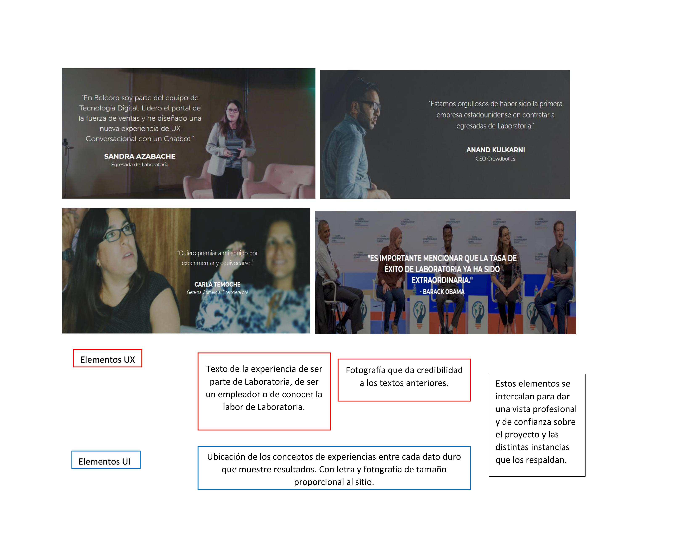

#SOLUCIONARIO

## Ejercicio 1 Definir partes conforman el UX y qué partes el UI de la web laboratora.

## Ejercicio 2 Identifica los elementos de navegación en github

## Ejercicio 3 Crea un sketch para la herramienta del dashboard de Laboratoria

