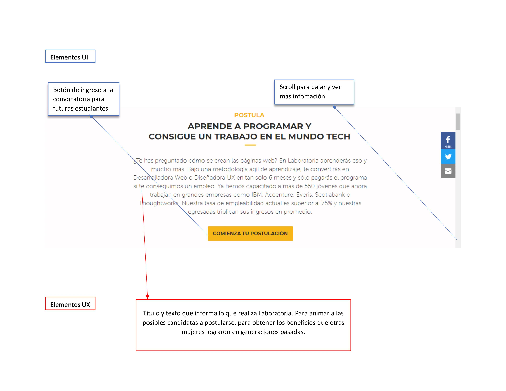

#SOLUCIONARIO

## Ejercicio 1 Definir partes conforman el UX y qué partes el UI de la web laboratoria.
# Los objetivos de negocio de Laboratoria son:
	a) Reclutamiento de mujeres que tengan gusto por la programación y tengan deseos de crecer y tener una carrera en la industria tecnológica.
	b) Reclutamiento de empresas que busquen talento con conocimientos en programación para incorporarse a sus equipos.
# Elementos generales de UX:  Por medio de distintos elementos se busca crear cohesión y credibilidad del proyecto, tiene dos principales grupos obetivos una son los empleadores y otras las futuras candidatas de laboratoria que quieren aplicar para los siguientes bootcamp. Por medio de iconos, imágenes, textos y frases se busca crear credibilidad, confianza para estos grupos objetivos. Con una interface amigable, que conserva la línea institucional, donde intercala datos duros y elemento emotivo.

# Elementos generales de UI: Se crea un eje de campaña con la conservación de colores y tipografía institucional, las imágenes son expresivas y se expanden a lo ancho del sitio, que contrasta con los textos. Se mantiene el equilibrio entre los elementos tanto en el ancho como en el alto, los botones de Call To Action (CTA) son precisos en una palabra, indica lo que ser requiere del usuario.

# En general es un diseño limpio e intuitivo, podría considerarse ser más explicitos en los botones del inicio para saber si estudiantes se refiere a las estudiantes en turno o las personas que quieren aplicar, cuando das scroll identificas la convocatoria, sin embargo sería conveniente tenerlo desde el menú principal está diferenciación.

  

## Ejercicio 2 Identifica los elementos de navegación en github
Fuente de información http://www.uxlumen.com/modelos-de-navegacion/

## Ejercicio 3 Crea un sketch para la herramienta del dashboard de Laboratoria

